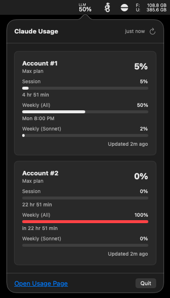
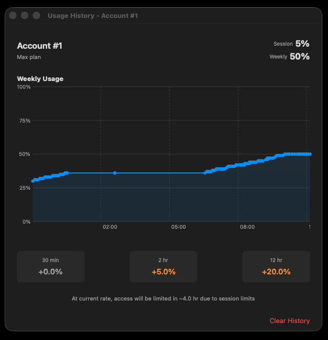

# Claude Monitor

Monitor your Claude AI usage with a macOS menu bar widget. Uses a browser extension to collect usage data from claude.ai and displays it in your menu bar.




## Why?

Anthropic doesn't provide API access to usage data for consumer subscriptions (Pro/Max). The only way to see your usage is at https://claude.ai/settings/usage, which is protected by Cloudflare bot detection.

This tool uses a browser extension to capture your usage data from your authenticated session, stores it in a local SQLite database, and displays it in a convenient menu bar widget.

## Features

- Real-time usage percentage in your macOS menu bar (Stats app style)
- Color-coded status: normal (<90%), orange (90-95%), red (>95%)
- Detailed breakdown: session limits, weekly limits (all models & Sonnet)
- Usage history charts
- Multi-account support via Firefox containers
- Auto-refreshes every 30 seconds

## Quick Install (End Users)

### 1. Download the macOS App
Download `ClaudeMonitor.zip` from [Releases](https://github.com/rjwalters/claude-monitor/releases)

Unzip and move `ClaudeMonitor.app` to your Applications folder.

**First run:** Right-click → "Open" (required for unsigned apps)

### 2. Install the Firefox Extension
Download `claude_monitor-x.x.xpi` from [Releases](https://github.com/rjwalters/claude-monitor/releases)

Drag the `.xpi` file into Firefox to install.

### 2b. Chrome Extension (Experimental)

A Chrome extension is available in the `extension-chrome/` folder but is **experimental and untested**. The developer uses Firefox, so Chrome support is provided on a best-effort basis.

To try it:
1. Open `chrome://extensions`
2. Enable "Developer mode"
3. Click "Load unpacked" and select the `extension-chrome/` folder
4. Run `native-host/install.sh` to set up native messaging for both browsers

**If you encounter issues with the Chrome extension, please [open an issue](https://github.com/rjwalters/claude-monitor/issues)** - we're happy to fix problems as they're reported.

### 3. Setup
1. Click the menu bar widget
2. Click "Install Native Bridge" (one-time setup)
3. Visit https://claude.ai/settings/usage in Firefox
4. Your usage data will appear in the menu bar!

## Architecture

```
┌─────────────────────────────────────────────────────────────────────────┐
│  Firefox Extension (runs on claude.ai/settings/usage)                   │
│  Extracts: session %, weekly limits, reset times, account info          │
└──────────────────────────┬──────────────────────────────────────────────┘
                           │ Native Messaging
                           ▼
┌─────────────────────────────────────────────────────────────────────────┐
│  Native Host (Node.js) → SQLite database (~/.claude-monitor/usage.db)  │
└──────────────────────────┬──────────────────────────────────────────────┘
                           │ Reads DB
                           ▼
┌─────────────────────────────────────────────────────────────────────────┐
│  macOS Menu Bar App (SwiftUI) - shows usage % with click for details   │
└─────────────────────────────────────────────────────────────────────────┘
```

## Development Setup

### Requirements

- macOS 13+ (Ventura or later)
- Firefox browser
- Node.js 18+
- Xcode Command Line Tools

### 1. Clone the repository

```bash
git clone https://github.com/rjwalters/claude-monitor.git
cd claude-monitor
```

### 2. Install dependencies

```bash
npm install
```

### 3. Install the Native Messaging Host

```bash
cd native-host
chmod +x install.sh
./install.sh
cd ..
```

### 4. Load the Firefox Extension (Development)

1. Open Firefox: `about:debugging`
2. Click "This Firefox" in the sidebar
3. Click "Load Temporary Add-on..."
4. Select `extension/manifest.json`

### 5. Build and Run the Menu Bar App

```bash
cd menubar-app/ClaudeMonitor
swift build
.build/debug/ClaudeMonitor &
```

### 6. Collect Data

Visit https://claude.ai/settings/usage in Firefox. The extension captures data automatically.

## Building for Release

### Build the Extension

```bash
./scripts/build-extension.sh
```

Output: `build/claude-monitor-extension.zip`

To sign for distribution:
1. Go to https://addons.mozilla.org/developers/
2. Submit as "Self-distributed" add-on
3. Download the signed `.xpi` file

### Build the macOS App

```bash
./scripts/build-macos-app.sh
```

Output: `build/ClaudeMonitor.zip`

## Auto-Start on Login (Optional)

To have the menu bar app start automatically:

```bash
# Create LaunchAgent
mkdir -p ~/Library/LaunchAgents

cat > ~/Library/LaunchAgents/com.claude-monitor.plist << 'EOF'
<?xml version="1.0" encoding="UTF-8"?>
<!DOCTYPE plist PUBLIC "-//Apple//DTD PLIST 1.0//EN" "http://www.apple.com/DTDs/PropertyList-1.0.dtd">
<plist version="1.0">
<dict>
    <key>Label</key>
    <string>com.claude-monitor</string>
    <key>ProgramArguments</key>
    <array>
        <string>/Users/YOUR_USERNAME/GitHub/claude-monitor/menubar-app/ClaudeMonitor/.build/debug/ClaudeMonitor</string>
    </array>
    <key>RunAtLoad</key>
    <true/>
    <key>KeepAlive</key>
    <false/>
</dict>
</plist>
EOF

# Update the path with your actual username
sed -i '' "s/YOUR_USERNAME/$(whoami)/g" ~/Library/LaunchAgents/com.claude-monitor.plist

# Load it
launchctl load ~/Library/LaunchAgents/com.claude-monitor.plist
```

To remove auto-start:
```bash
launchctl unload ~/Library/LaunchAgents/com.claude-monitor.plist
rm ~/Library/LaunchAgents/com.claude-monitor.plist
```

## Multiple Accounts

For multiple Claude accounts, use [Firefox Multi-Account Containers](https://addons.mozilla.org/en-US/firefox/addon/multi-account-containers/):

1. Install the Multi-Account Containers extension
2. Create a container for each Claude account
3. Open claude.ai/settings/usage in each container
4. Each account will be tracked separately in the menu bar app

## Troubleshooting

### Menu bar shows "C: --"

No data has been collected yet. Visit https://claude.ai/settings/usage with the extension loaded.

### Native host not connecting

1. Re-run the install script (creates manifests for Firefox & Chrome):
   ```bash
   cd native-host && ./install.sh
   ```

2. **Restart your browser** (required after installing native host)

3. Check the manifest exists:
   ```bash
   # Firefox
   cat ~/Library/Application\ Support/Mozilla/NativeMessagingHosts/claude_monitor.json
   # Chrome
   cat ~/Library/Application\ Support/Google/Chrome/NativeMessagingHosts/claude_monitor.json
   ```

4. Test manually:
   ```bash
   cd claude-monitor
   node -e 'const m=JSON.stringify({type:"GET_DATA"});const b=Buffer.alloc(4);b.writeUInt32LE(Buffer.byteLength(m),0);process.stdout.write(b);process.stdout.write(m);' | ./native-host/claude_monitor_host.sh
   ```

### Extension not capturing data

1. Check the browser console (Cmd+Option+J) for errors
2. Make sure you're on exactly `https://claude.ai/settings/usage`
3. Try refreshing the page

### Database location

All data is stored locally in:
```
~/.claude-monitor/usage.db
```

Query it directly:
```bash
sqlite3 ~/.claude-monitor/usage.db "SELECT * FROM accounts;"
sqlite3 ~/.claude-monitor/usage.db "SELECT timestamp, primary_percent FROM usage_history ORDER BY timestamp DESC LIMIT 10;"
```

## Uninstall

```bash
# Stop the menu bar app
pkill ClaudeMonitor

# Remove LaunchAgent (if installed)
launchctl unload ~/Library/LaunchAgents/com.claude-monitor.plist 2>/dev/null
rm ~/Library/LaunchAgents/com.claude-monitor.plist 2>/dev/null

# Remove native hosts
rm ~/Library/Application\ Support/Mozilla/NativeMessagingHosts/claude_monitor.json
rm ~/Library/Application\ Support/Google/Chrome/NativeMessagingHosts/claude_monitor.json 2>/dev/null

# Remove data
rm -rf ~/.claude-monitor

# Remove the extension from Firefox (about:debugging > This Firefox > Remove)

# Delete the repo
rm -rf /path/to/claude-monitor
```

## Project Structure

```
claude-monitor/
├── extension/                    # Firefox extension (MV2)
│   ├── manifest.json            # Extension manifest
│   ├── content.js               # Scrapes usage data from claude.ai
│   ├── background.js            # Sends data to native host
│   ├── popup.html/js            # Extension popup UI
│   └── README.md
├── extension-chrome/             # Chrome extension (MV3, experimental)
│   ├── manifest.json            # MV3 manifest with stable extension key
│   ├── content.js               # Same as Firefox
│   ├── background.js            # Service worker (uses chrome.action)
│   └── popup.html/js            # Same as Firefox
├── native-host/                  # Native messaging host
│   ├── claude_monitor_host.cjs  # Node.js script (SQLite)
│   ├── claude_monitor_host.sh   # Shell wrapper (ensures node in PATH)
│   └── install.sh               # Installation script (Firefox & Chrome)
├── menubar-app/ClaudeMonitor/   # macOS menu bar app
│   ├── Package.swift            # Swift package definition
│   └── Sources/
│       ├── main.swift           # App entry point
│       ├── UsageStore.swift     # SQLite data access
│       └── UsagePopoverView.swift # SwiftUI UI
├── src/                          # CLI tool (optional)
│   ├── cli.ts
│   └── reader.ts
└── package.json
```

## License

MIT
