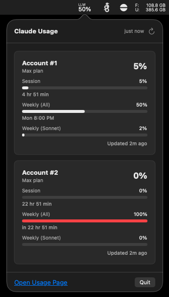

# Claude Monitor

Monitor your Claude AI usage with a macOS menu bar widget. Reads OAuth credentials from the Claude Code keychain to poll usage data directly from the Anthropic API.




## Why?

Anthropic doesn't provide API access to usage data for consumer subscriptions (Pro/Max). The only way to see your usage is at https://claude.ai/settings/usage, which is protected by Cloudflare bot detection.

This tool uses Claude Code's OAuth credentials (stored in the macOS Keychain) to fetch your usage data directly from the Anthropic API and display it in a convenient menu bar widget.

## Features

- Real-time usage percentage in your macOS menu bar (Stats app style)
- Color-coded status: normal (<90%), orange (90-95%), red (>95%)
- Detailed breakdown: session limits, weekly limits (all models & Sonnet)
- Usage history charts with token usage overlay
- Multi-account support via OAuth keychain credentials
- Account switching (right-click menu bar icon or popover picker)
- Token health monitoring with re-auth prompts
- Auto-refreshes every 30 seconds with exponential backoff on errors

## Quick Install (End Users)

### 1. Prerequisites

- macOS 13+ (Ventura or later)
- [Claude Code](https://docs.anthropic.com/en/docs/claude-code) installed and signed in

### 2. Download the macOS App

Download `ClaudeMonitor.zip` from [Releases](https://github.com/rjwalters/claude-monitor/releases)

Unzip and move `ClaudeMonitor.app` to your Applications folder.

**First run:** Right-click > "Open" (required for unsigned apps)

### 3. Setup

1. Click the menu bar widget
2. Click "Import from Claude Code"
3. Your usage data will appear in the menu bar!

### Multiple Accounts

Claude Monitor supports multiple Claude Code accounts:

1. Sign into each account with Claude Code (each gets a separate keychain entry)
2. Click the "+" button in the footer to re-scan the keychain
3. Right-click the menu bar icon to quickly switch which account shows in the badge
4. Use the account picker in the popover to change the primary displayed account

## Architecture

```
┌─────────────────────────────────────────────────────────────────────────┐
│  macOS Keychain (Claude Code OAuth credentials)                         │
└──────────────────────────┬──────────────────────────────────────────────┘
                           │ Reads tokens
                           ▼
┌─────────────────────────────────────────────────────────────────────────┐
│  OAuthPoller → Anthropic API → SQLite (~/.claude-monitor/usage.db)      │
│  - Concurrent polling per account with exponential backoff              │
│  - Auto-detects new keychain entries every 5 minutes                    │
│  - Token health monitoring (valid/expired/revoked)                      │
└──────────────────────────┬──────────────────────────────────────────────┘
                           │ Reads DB
                           ▼
┌─────────────────────────────────────────────────────────────────────────┐
│  macOS Menu Bar App (SwiftUI) - shows usage % with click for details    │
│  - Left-click: popover with account cards                               │
│  - Right-click: quick account switcher                                  │
└─────────────────────────────────────────────────────────────────────────┘
```

## Development Setup

### Requirements

- macOS 13+ (Ventura or later)
- Xcode Command Line Tools
- Claude Code installed and signed in

### 1. Clone the repository

```bash
git clone https://github.com/rjwalters/claude-monitor.git
cd claude-monitor
```

### 2. Build and Run the Menu Bar App

```bash
cd menubar-app/ClaudeMonitor
swift build
.build/debug/ClaudeMonitor &
```

### 3. Import Credentials

Click the menu bar widget, then click "Import from Claude Code" to read your Claude Code OAuth credentials from the macOS Keychain.

## Building for Release

```bash
./scripts/build-macos-app.sh
```

Output: `build/ClaudeMonitor.zip`

## Auto-Start on Login (Optional)

```bash
# Create LaunchAgent
mkdir -p ~/Library/LaunchAgents

cat > ~/Library/LaunchAgents/com.claude-monitor.plist << 'EOF'
<?xml version="1.0" encoding="UTF-8"?>
<!DOCTYPE plist PUBLIC "-//Apple//DTD PLIST 1.0//EN" "http://www.apple.com/DTDs/PropertyList-1.0.dtd">
<plist version="1.0">
<dict>
    <key>Label</key>
    <string>com.claude-monitor</string>
    <key>ProgramArguments</key>
    <array>
        <string>/Users/YOUR_USERNAME/GitHub/claude-monitor/menubar-app/ClaudeMonitor/.build/debug/ClaudeMonitor</string>
    </array>
    <key>RunAtLoad</key>
    <true/>
    <key>KeepAlive</key>
    <false/>
</dict>
</plist>
EOF

# Update the path with your actual username
sed -i '' "s/YOUR_USERNAME/$(whoami)/g" ~/Library/LaunchAgents/com.claude-monitor.plist

# Load it
launchctl load ~/Library/LaunchAgents/com.claude-monitor.plist
```

To remove auto-start:
```bash
launchctl unload ~/Library/LaunchAgents/com.claude-monitor.plist
rm ~/Library/LaunchAgents/com.claude-monitor.plist
```

## Troubleshooting

### Menu bar shows "LLM --"

No data has been collected yet. Click the widget and import your Claude Code credentials.

### Import fails

1. Make sure Claude Code is installed and you've signed in (`claude` in terminal)
2. Check that the keychain entry exists: Keychain Access > search "Claude Code"
3. The app needs permission to read the keychain — click "Always Allow" when prompted

### Database location

All data is stored locally in:
```
~/.claude-monitor/usage.db
```

Query it directly:
```bash
sqlite3 ~/.claude-monitor/usage.db "SELECT * FROM accounts;"
sqlite3 ~/.claude-monitor/usage.db "SELECT timestamp, primary_percent FROM usage_history ORDER BY timestamp DESC LIMIT 10;"
```

## Uninstall

```bash
# Stop the menu bar app
pkill ClaudeMonitor

# Remove LaunchAgent (if installed)
launchctl unload ~/Library/LaunchAgents/com.claude-monitor.plist 2>/dev/null
rm ~/Library/LaunchAgents/com.claude-monitor.plist 2>/dev/null

# Remove data
rm -rf ~/.claude-monitor

# Delete the repo
rm -rf /path/to/claude-monitor
```

## Project Structure

```
claude-monitor/
├── menubar-app/ClaudeMonitor/   # macOS menu bar app
│   ├── Package.swift            # Swift package definition
│   └── Sources/
│       ├── main.swift           # App entry point, menubar, right-click menu
│       ├── UsageStore.swift     # SQLite data access, settings
│       ├── UsagePopoverView.swift # SwiftUI popover UI
│       ├── UsageChartView.swift # Chart window
│       ├── OAuthPoller.swift    # OAuth polling, keychain, retry logic
│       └── AnthropicAPI.swift   # API client, response types
├── src/                          # CLI tool (optional)
│   ├── cli.ts
│   └── reader.ts
├── scripts/
│   └── build-macos-app.sh       # Build script for distribution
└── package.json
```

## Related Projects

- **[ccusage](https://github.com/ryoppippi/ccusage)** - CLI tool that analyzes Claude Code token usage from local JSONL files. Shows daily/monthly reports, session breakdowns, and cost estimates. Run with `npx ccusage@latest`.

- **[VibePulse](https://github.com/wesm/vibepulse)** - macOS menu bar app for tracking Claude Code + Codex token spend. Built on ccusage, displays real-time consumption with 30-day analytics.

**How they differ from Claude Monitor:**
- ccusage/VibePulse read **local Claude Code logs** → show token counts and API-equivalent costs
- Claude Monitor reads **the Anthropic API via OAuth** → shows quota percentages and reset times

Claude Monitor now integrates local token data alongside OAuth-sourced quota info, giving you both views in one app.

## License

MIT
