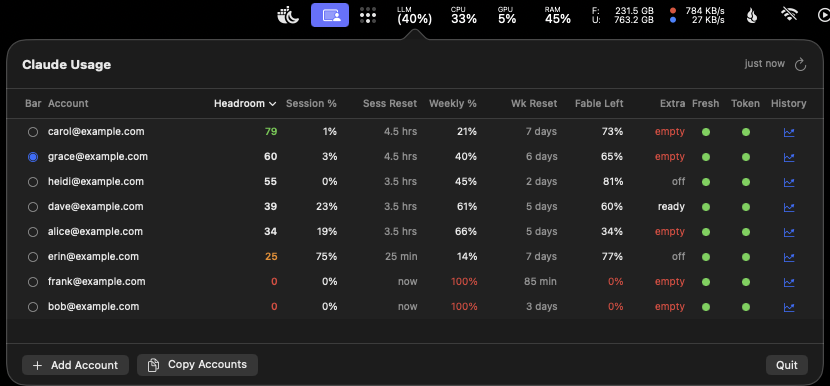
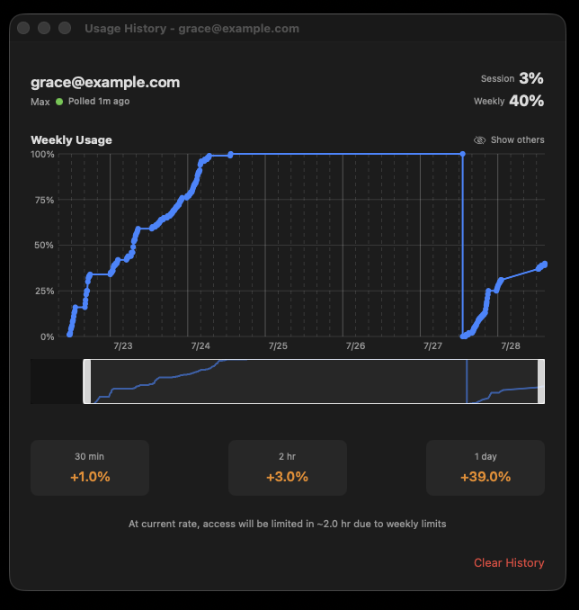

# Claude Monitor

Monitor your Claude AI usage with a macOS menu-bar widget. Polls the Anthropic
API with long-lived OAuth tokens (one or many) and surfaces quota, reset times,
and usage trends without leaving your menu bar.




## Why?

Anthropic doesn't expose a documented public API for checking consumer
subscription usage (Pro/Max). The web dashboard at
https://claude.ai/settings/usage shows your limits but has no programmatic
equivalent.

Claude Monitor calls the same internal endpoints that Claude Code uses, using
OAuth tokens you provide, and renders the data locally on your Mac.

## Features

- **Live usage % in the menu bar** (Stats-app style), color-coded — orange at
  90%, red above 95%.
- **Summary table popover.** All accounts at a glance: session %, weekly %,
  reset times, data freshness, token health, and a one-click chart launcher
  per row.
- **Headroom score** (0–100). A single number — `100 − max(session %,
  weekly %)` — answering "which account should I be using". Default sort.
- **Click any column header to sort.** Account, Headroom, percents, reset
  times, freshness, token status. Chevron marks the active column; click
  again to flip direction. Rows without data sort to the bottom.
- **Pin which account drives the menu bar.** Radio button on each row. Click
  to pin; click again to revert to auto-pick (most-available). Pinning
  survives restarts.
- **Per-row history charts.** Click the chart icon to open a usage-history
  window for that account; the popover stays open so you can open several
  side-by-side and compare.
- **Multi-account.** Add accounts one-by-one via a token from
  `claude setup-token`, or bulk-import from a `.env` file with
  `ACCOUNT_EMAIL_N` / `ACCOUNT_KEY_N` pairs.
- **Multi-provider.** Anthropic and OpenAI/ChatGPT (Codex) accounts sit side by
  side in the same table, each row tagged with a pixel-art provider badge. See
  [Adding an OpenAI (Codex) Account](#adding-an-openai-codex-account).
  A provider that reports no session window (ChatGPT often reports only a
  weekly one) shows "—" rather than a fabricated 0%.
- **Per-model sub-limits.** OpenAI accounts report per-model limits alongside
  the account-level window; these are stored and overlaid on the per-account
  history chart. The overlay is hidden for accounts that have none.
- **Roll Token wizard.** Guided revoke-all + re-mint for an account's
  long-lived token (right-click its row → "Roll Token…"). A temporary stopgap
  until Anthropic ships a token-management API — see
  [Rolling a Token](#rolling-a-token-revoke--re-mint).
- **All data stored locally** in SQLite at `~/.claude-monitor/usage.db`.

## Quick Install

### 1. Prerequisites

- macOS 13+ (Ventura or later)
- [Claude Code](https://docs.anthropic.com/en/docs/claude-code) installed (you
  use it to generate the OAuth tokens via `claude setup-token`)

### 2. Download

Grab `ClaudeMonitor.zip` from
[Releases](https://github.com/rjwalters/claude-monitor/releases), unzip, and
move `ClaudeMonitor.app` to `/Applications`.

**First run:** right-click → **Open** (required for unsigned apps).

### 3. Get a Long-Lived OAuth Token

Run this in a terminal:

```bash
claude setup-token
```

It opens a browser, asks you to authorize, and prints a token like
`sk-ant-oat01-…`. These tokens are **long-lived (~1 year)** so a single
authorization powers the menu bar for the entire lifetime — no refresh dance
needed. If you ever need to revoke and replace one (e.g., after a leak), see
[Rolling a Token](#rolling-a-token-revoke--re-mint).

### 4. Add the Account

1. Click the menu-bar widget.
2. Click **+ Add Account** in the footer.
3. Paste the token, click **Add Account**.

Your usage data shows up in the menu bar immediately.

### Multiple Accounts

If you maintain tokens for several accounts (e.g., in a `.env` for an agent
pool), use the **Bulk Import** field in the Add Account dialog
(`.env.example` in the repo is a starter template):

```env
ACCOUNT_EMAIL_1=you@example.com
ACCOUNT_KEY_1=sk-ant-oat01-...
ACCOUNT_EMAIL_2=agent@example.com
ACCOUNT_KEY_2=sk-ant-oat01-...
```

Point the importer at the file path; each pair is validated via a ping and
added on success. Pinning, sorting, and per-account charts work the same way
regardless of how the accounts were added.

#### Master account list (auto-loaded at launch)

Instead of importing by hand, keep a master list that the app loads every time
it starts:

- `~/.claude-monitor/accounts.env` — the master list (shared source of truth)
- `~/.claude-monitor/accounts.local.env` — local overrides and additions (keep
  this machine-specific; don't share it)

Both use the same `ACCOUNT_EMAIL_N` / `ACCOUNT_KEY_N` format. At launch the app
merges them (the local file **overrides** the master token for a matching email
and **appends** any new emails), then imports the result. Loading is
**additive**: accounts in the lists are added or have their token refreshed, but
accounts already in the app that aren't listed are left untouched — nothing is
removed. Store these files with `chmod 600`; they contain live tokens.

### Adding an OpenAI (Codex) Account

ChatGPT subscription accounts (Plus/Pro, the ones Codex CLI uses) are polled
too. Their usage comes from a dedicated read-only endpoint —
`GET https://chatgpt.com/backend-api/wham/usage`, the same one Codex CLI's own
`/usage` command calls — so no inference request is burned to read it.

A ChatGPT credential is not a single pasteable string (it's an access token +
refresh token + expiry), so it's **imported** from Codex CLI's own credential
store rather than typed in:

```bash
codex login                    # once, if you haven't already
claude-monitor codex import    # or: Add Account → "Import Codex Account"
```

The importer reads `$CODEX_HOME/auth.json` when `CODEX_HOME` is set, otherwise
`~/.codex/auth.json`. Pass `--auth <path>` to read a different file. The
credential is validated against the live usage endpoint before it's stored, and
the account's email, plan, and OpenAI account id all come back in that same
response — there's no separate profile call.

What differs from an Anthropic row once it's added:

- **Session % may be blank.** OpenAI reports its windows as
  `primary_window` / `secondary_window`, each carrying its own length, and a
  ChatGPT Pro account can legitimately report only a **weekly** window. When
  there's no session window, the Session cells show `—`. That is a real
  "unknown", not 0% — the headroom score and sorting use whichever windows
  actually exist.
- **Premium % / Extra are always `—`.** Those columns track Anthropic
  premium tiers; the Fable probe is skipped for OpenAI accounts entirely. (The
  premium column is titled "Fable %" only when every account in the table
  is Anthropic; with any OpenAI row present it shows the neutral
  "Premium %".)
- **Tokens expire, and are renewed for you.** An OpenAI access token lives
  about 10 days. The poller renews it from the stored refresh token
  *proactively* — 6 hours ahead of expiry, never waiting for a 401 — and the
  Token dot reports the outcome: green (healthy), **yellow** (renewal is
  failing but the current token still works; hover for the reason), **red**
  (expired and unrenewable — re-run `claude-monitor codex import`). A stale
  OpenAI account never fails silently.

> **Note on refresh-token rotation.** OpenAI **does** rotate the refresh token
> on renewal (verified 2026-07-31). This app stores the new pair in its own
> database and does **not** write back to `~/.codex/auth.json`, so two
> consequences follow:
>
> - **Codex CLI will eventually need a re-login.** Its stored refresh token is
>   invalidated by the rotation. Its *access* token keeps working until it
>   expires, so nothing breaks immediately — but once it does, run
>   `codex login` and then `claude-monitor codex import`.
> - **Other machines running this app need re-syncing.** A second host that
>   imported the same credential still holds the pre-rotation token and will
>   fail its own renewal. Push the refreshed credential to it with
>   `accounts export` → `accounts import` (see
>   [Multi-host sync](#multi-host-sync)),
>   or just re-run `codex import` there after a fresh `codex login`.

### Rolling a Token (revoke + re-mint)

> **Temporary workaround.** Anthropic exposes no supported API to list, revoke,
> or programmatically mint long-lived `sk-ant-oat01` tokens, so this workflow
> leans on undocumented claude.ai internals plus manual browser steps. It
> should be revisited (and ideally replaced) once Anthropic ships a real
> token-management API — see
> [anthropics/claude-code#43801](https://github.com/anthropics/claude-code/issues/43801)
> (revocation doesn't reliably invalidate tokens),
> [#22995](https://github.com/anthropics/claude-code/issues/22995)
> (token/session management dashboard request),
> [#48373](https://github.com/anthropics/claude-code/issues/48373)
> (`claude setup-token --list` / `--revoke` request), and
> [#59378](https://github.com/anthropics/claude-code/issues/59378)
> (per-session token minting).

If a token leaks — or you just want to rotate one — right-click the account's
row in the popover and choose **"Roll Token…"**. A per-account wizard window
opens (its header shows a "Last rolled …" timestamp) and walks you through
four steps:

1. **Log in as this account.** A button opens
   `https://claude.ai/settings/claude-code` in your browser; make sure the
   browser is signed in as the account being rolled.
2. **Revoke the old tokens.** A button copies a browser-console script with
   the account's org id baked in. Paste it into the browser console (⌥⌘J) on
   the logged-in claude.ai page and press Return. It revokes **every**
   authorization token on the account — this signs out all devices using it.
3. **Mint a new token.** Run `claude setup-token` in a terminal (copy button
   provided), complete the browser login, and paste the printed
   `sk-ant-oat01-…` back into the wizard. The wizard verifies the token and
   **rejects it if its org id doesn't match the account being rolled** — a
   guard against accidentally pasting a different account's token into the
   wrong roll.
4. **Verify the old token is revoked.** After a successful import, the wizard
   pings the token this account had *before* the roll. If the API rejects it
   with 401 you get "Revoked ✓"; if it still answers (200 or 429 — both mean
   the token still authenticates) you get "Still valid!"; a network or server
   error shows "Couldn't check".

#### Why it works this way (undocumented endpoints)

The console script hits internal claude.ai endpoints with no public,
documented equivalent:

- List tokens:
  `GET https://claude.ai/api/oauth/organizations/{org}/oauth_tokens`
- Revoke one:
  `POST https://claude.ai/api/oauth/organizations/{org}/oauth_tokens/{id}/revoke`

Both authenticate with the **claude.ai web session cookie**
(`credentials: 'include'`), not the Bearer token — the OAuth token itself gets
`account_session_invalid`. That's why revocation can only run pasted into a
browser console on a logged-in claude.ai page, never from the app itself.
Minting can't be automated either: `claude setup-token` requires interactive
browser OAuth.

The script is defensive about known flakiness: it re-lists live tokens between
revoke rounds and retries stragglers for up to 10 rounds, and a 403 on the
list call means the browser is logged into a different account (the script
aborts with a clear error).

Because these endpoints are undocumented, they may change without notice. If a
roll stops working, the script template in `TokenRoller.revokeAllScript`
(`menubar-app/ClaudeMonitor/Sources/TokenRoller.swift`) is the single place to
update.

Finally, server-side revocation is known to lag or silently fail (see
anthropics/claude-code#43801 above) — which is exactly why step 4 exists: the
app independently verifies the old token with its own ping rather than
trusting that the revoke succeeded.

## Direct API Access (no app needed)

The whole app is just a wrapper around a single, cheap API call. With a
`sk-ant-oat01-…` token from `claude setup-token` you can fetch the same usage
data the menu bar shows, using only `curl`. Both a 200 (Haiku reply) and a 429
(rate-limited) response carry the usage data in headers:

```bash
TOKEN='sk-ant-oat01-...'   # from `claude setup-token`

curl -sS -D - -o /dev/null https://api.anthropic.com/v1/messages \
  -H "Authorization: Bearer $TOKEN" \
  -H "anthropic-version: 2023-06-01" \
  -H "anthropic-beta: oauth-2025-04-20" \
  -H "User-Agent: claude-code/2.0.37" \
  -H "Content-Type: application/json" \
  -d '{"model":"claude-haiku-4-5-20251001","max_tokens":1,"messages":[{"role":"user","content":"x"}]}' \
  | grep -i '^anthropic-'
```

The interesting headers in the response:

| Header                                        | Meaning                              |
| --------------------------------------------- | ------------------------------------ |
| `anthropic-organization-id`                   | Which account this token belongs to  |
| `anthropic-ratelimit-unified-5h-utilization`  | Session quota used (0.0–1.0)         |
| `anthropic-ratelimit-unified-5h-reset`        | Session reset (epoch seconds)        |
| `anthropic-ratelimit-unified-7d-utilization`  | Weekly quota used (0.0–1.0)          |
| `anthropic-ratelimit-unified-7d-reset`        | Weekly reset (epoch seconds)         |
| `anthropic-ratelimit-unified-status`          | `allowed` / `allowed_warning` / etc. |

Each call costs ~1 Haiku output token (effectively free). The
`oauth-2025-04-20` beta flag is what lets the OAuth-issued token authenticate
against `/v1/messages`.

## Architecture

```
┌──────────────────────────────────────────────────────────────────────────┐
│  OAuth credentials                                                       │
│    - `claude setup-token` (single, paste-in)            [anthropic]      │
│    - `.env` bulk import (ACCOUNT_EMAIL_N / ACCOUNT_KEY_N) [anthropic]    │
│    - `claude-monitor codex import` (~/.codex/auth.json)   [openai]       │
└────────────────────────────────┬─────────────────────────────────────────┘
                                 │ stored in
                                 ▼
┌──────────────────────────────────────────────────────────────────────────┐
│  SQLite — ~/.claude-monitor/usage.db                                     │
│    accounts │ oauth_credentials │ usage_history │ settings               │
│    (accounts.provider / oauth_credentials.provider tag the upstream)     │
└────────────────────────────────┬─────────────────────────────────────────┘
                                 │ read by
                                 ▼
┌──────────────────────────────────────────────────────────────────────────┐
│  OAuthPoller — one client per provider, one shared window model          │
│    anthropic: POST /v1/messages (1-token ping) → rate-limit headers      │
│               tokens are long-lived (~1 yr); no refresh dance needed     │
│    openai:    GET /backend-api/wham/usage → rate_limit.{primary,         │
│               secondary}_window; access tokens live ~10 days and are     │
│               refreshed proactively via auth.openai.com/oauth/token      │
│    - Each account polled once per 10 min (staggered)                     │
└────────────────────────────────┬─────────────────────────────────────────┘
                                 │ data drives
                                 ▼
┌──────────────────────────────────────────────────────────────────────────┐
│  Menu-bar app (SwiftUI)                                                  │
│    Left-click  → summary-table popover                                   │
│    Right-click → quick account switcher (opens chart for the pick)       │
└──────────────────────────────────────────────────────────────────────────┘
```

## Development

### Requirements

- macOS 13+
- Xcode Command Line Tools (`xcode-select --install`)
- Claude Code (to generate tokens)

### Build & Run

```bash
git clone https://github.com/rjwalters/claude-monitor.git
cd claude-monitor/menubar-app/ClaudeMonitor
swift build
.build/debug/ClaudeMonitor &
```

CI (`.github/workflows/build.yml`) runs on pushes to `main` and on pull requests:
two jobs build the package — macOS and a `swift:6.1` Linux container — and each
runs `ClaudeMonitor selftest`, with the Linux job also smoke-running `--once`.

**Manually re-triggering CI.** The `push`/`pull_request` webhook deliveries
that normally queue a run can silently stop firing for a stretch of time —
with no change to the workflow file, Actions settings, or repo state (see
[#66](https://github.com/rjwalters/claude-monitor/issues/66)). Since the
workflow also carries a bare `workflow_dispatch:` trigger, you can queue a run
directly against any branch (including an open PR's head) without depending
on that webhook:

```bash
gh workflow run build.yml --ref <branch-name>
```

or use the Actions tab's "Run workflow" button. If checks are missing on an
open PR and re-running doesn't help, next check (needs repo-admin access):
Settings → Actions → General (Actions permissions toggle), Settings →
Webhooks → Recent Deliveries (look for failed/missing `pull_request`
deliveries), and https://www.githubstatus.com/history for an Actions/Webhooks
incident.

### Build for Distribution

```bash
./scripts/build-macos-app.sh
```

The script auto-detects the installed `claude-code` npm version and patches
the User-Agent string in `AnthropicAPI.swift` before compiling. Output:
`build/ClaudeMonitor.app` and `build/ClaudeMonitor.zip`.

When replacing `/Applications/ClaudeMonitor.app`, you must `rm -rf` the old
bundle before copying — `cp -R` over a running app does not replace the
binary. See `CLAUDE.md` for the exact sequence.

## Headless Mode / Linux

The same package builds on Linux as a headless daemon — no UI, same poll loop
(account-file sync, 10-minute usage pings, 20-minute Fable probes) writing the
same `~/.claude-monitor/usage.db` and `ranking.json`. This is what Loom hosts
run.

### Build (Linux)

Requires a Swift toolchain ([swift.org](https://www.swift.org/install/) or the
`swift:6.1` Docker image) and the SQLite dev headers:

```bash
sudo apt-get install libsqlite3-dev   # (yum: sqlite-devel)
cd claude-monitor/menubar-app/ClaudeMonitor
swift build -c release
sudo cp .build/release/ClaudeMonitor /usr/local/bin/claude-monitor
```

### Run

Put your accounts in `~/.claude-monitor/accounts.env`
(`ACCOUNT_EMAIL_N` / `ACCOUNT_KEY_N` pairs, same format as the app's bulk
import — see [Multiple Accounts](#multiple-accounts)), then:

```bash
claude-monitor                  # poll loop, logs to stdout + ~/.claude-monitor/debug.log
claude-monitor --once           # one poll cycle, write ranking.json, exit
claude-monitor --interval 300   # override per-account poll interval (seconds, min 60)
claude-monitor --version        # print the version and exit
claude-monitor selftest         # self-check (no network/credentials); non-zero exit on failure
```

`selftest` also takes `--db <path>` (migrate and verify a **copy** of a real
database — it writes, so never point it at the live `usage.db`) and
`--wire <path>` (decode a captured `/wham/usage` body offline to re-check the
OpenAI wire contract; prints only derived numbers, never identity fields).
Run `claude-monitor selftest --help` for details.

Edits to `accounts.env` / `accounts.local.env` are picked up automatically
while the daemon runs. A sample systemd user unit is provided at
`scripts/claude-monitor.service`.

On macOS the same headless loop is available as `ClaudeMonitor --headless`
(the bare binary or the app bundle's `Contents/MacOS/ClaudeMonitor`).
`ClaudeMonitor --version` prints the version and exits on macOS with or
without `--headless` — it never launches the GUI. `--once` and `--interval`
are headless-loop flags: bare (without `--headless`) they print an error to
stderr and exit non-zero rather than launching a duplicate GUI instance, e.g.
`ClaudeMonitor --headless --once`.

## Multi-Host Sync

When multiple hosts each run their own `claude-monitor` (e.g. two Macs + a
fleet of headless Linux workers), account records and OAuth credentials added
on one host don't automatically appear on the others. `claude-monitor
accounts export` / `import` is the blessed, headless-safe way to converge
them — no GUI required, works identically on macOS and Linux:

```bash
# On the source host: dump account records + credentials to a file (0600).
claude-monitor accounts export --output accounts.json

# Copy it to each destination host over a trusted channel (scp, etc.),
# then converge that host's own usage.db:
claude-monitor accounts import accounts.json
```

- **What's synced:** account identity (id, name, email, plan) and OAuth
  credentials (access/refresh tokens, expiry, scopes, plan tier). Usage
  history, rankings, and poll status are **not** synced — those stay local to
  each host's own polling.
- **Idempotent, upsert-by-email:** `import` matches accounts by email
  (falling back to id when email is absent), creates any account it doesn't
  find locally, and updates the rest — except it **never regresses a newer
  local record**: if the local `last_updated` is at least as recent as the
  imported one, that account is left untouched. Safe to re-run against the
  same file, and safe to import an older export after newer local polls.
  `--dry-run` previews the account count without writing anything.
- **Credentials are secrets:** the export is plaintext JSON containing live
  OAuth tokens. `--output <path>` writes it with `0600` permissions and the
  command prints a warning either way; without `--output` (stdout, e.g. for
  `> accounts.json`) permissions aren't set for you — `chmod 600` the result,
  transfer it over a trusted channel, and delete it once every destination
  host has imported. Full at-rest/in-transit encryption (age, openssl) is a
  natural next step but out of scope for the first pass here.
- **No `--headless` flag needed** — `accounts export`/`import` are one-shot
  operations, reachable directly on both platforms even from the macOS GUI
  build: `ClaudeMonitor accounts export ...`.

Run `claude-monitor accounts --help` for the full flag list.

## Ranking Export (`ranking.json`)

After every poll cycle the app writes a small, **non-secret**, email-keyed
snapshot to `~/.claude-monitor/ranking.json` for external multi-account load
balancers (notably `loom-daemon`, which uses it to pick a token). It's written
atomically, so a reader never sees a partial document.

```jsonc
{
  "schema": 1,
  "generated_at": "2026-07-30T18:00:00Z",
  "accounts": [
    {
      "email":       "you@example.com",   // the join key
      "provider":    "anthropic",         // "anthropic" | "openai"
      "plan":        "max_20x",
      "status":      "available",         // available | rate_limited | exhausted | blocked
      "utilization": { "5h": 0.12, "7d": 0.44 },   // 0.0–1.0
      "resets":      { "5h": "…Z", "7d": "…Z" },
      "models":      { "fable": { "utilization": 0.30 } },   // optional
      "updated_at":  "2026-07-30T17:58:00Z"
    },
    {
      "email":       "you@example.com",
      "provider":    "openai",
      "plan":        "pro",
      "status":      "available",
      "utilization": { "7d": 0.14 },      // note: no "5h" key — see below
      "resets":      { "7d": "…Z" },
      "updated_at":  "2026-07-30T17:58:00Z"
    }
  ]
}
```

**Schema change for consumers (added with OpenAI support):**

- **`provider` is new and additive.** It is emitted for *every* account and is
  `"anthropic"` or `"openai"`; accounts that predate multi-provider support
  report `"anthropic"`. `schema` stays **1** on purpose — the version number
  tracks breaking changes, and adding an optional key breaks nobody. A consumer
  that ignores `provider` behaves exactly as it did before. Treat an unrecognized
  future value as "some other provider" rather than rejecting the document.
- **`utilization["5h"]` can be absent on an `openai` account.** The ChatGPT
  usage endpoint may report a weekly window and no session window at all.
  A missing key means **unknown**, not `0.0` — reading it as zero would make an
  account look like it has full session capacity. The same applies to
  `resets["5h"]`. (Anthropic accounts always report both windows.)
- Accounts with a `NULL` email are still excluded entirely; `email` remains the
  sole join key, and it is not unique across providers — one person's Anthropic
  and OpenAI accounts can share an address, distinguished by `provider`.
- No credential material ever appears in this file.

## Auto-Start on Login (Optional)

```bash
mkdir -p ~/Library/LaunchAgents

cat > ~/Library/LaunchAgents/com.claude-monitor.plist << 'EOF'
<?xml version="1.0" encoding="UTF-8"?>
<!DOCTYPE plist PUBLIC "-//Apple//DTD PLIST 1.0//EN" "http://www.apple.com/DTDs/PropertyList-1.0.dtd">
<plist version="1.0">
<dict>
    <key>Label</key>
    <string>com.claude-monitor</string>
    <key>ProgramArguments</key>
    <array>
        <string>/Applications/ClaudeMonitor.app/Contents/MacOS/ClaudeMonitor</string>
    </array>
    <key>RunAtLoad</key>
    <true/>
    <key>KeepAlive</key>
    <false/>
</dict>
</plist>
EOF

launchctl load ~/Library/LaunchAgents/com.claude-monitor.plist
```

To remove auto-start:

```bash
launchctl unload ~/Library/LaunchAgents/com.claude-monitor.plist
rm ~/Library/LaunchAgents/com.claude-monitor.plist
```

## Troubleshooting

### Menu bar shows "LLM --"

No data yet. Click the widget → **+ Add Account** → paste a token from
`claude setup-token`.

### A new account doesn't appear after import

The import dialog calls `refreshAll` after a successful add, so all 10/13/etc.
accounts should appear when the popover reopens. If a token dot stays gray,
the next 30 s poll tick hasn't filled in token status yet — click the
↻ refresh icon in the popover header.

### Rolled token still shows as valid

Anthropic-side revocation is known to be unreliable or slow to take effect
([anthropics/claude-code#43801](https://github.com/anthropics/claude-code/issues/43801)),
which is why the [Roll Token wizard](#rolling-a-token-revoke--re-mint)'s final
step pings the old token itself — still answers (200/429) means still valid,
rejected (401) means revoked — instead of trusting the revoke call. If the
badge says "Still valid!", re-run the revoke console script from step 2 (it
automatically retries tokens that survive a round) and click **Verify old
token revoked** again. "Couldn't check" means the ping itself failed
(network/5xx) — try again later.

### Logs

```
~/.claude-monitor/debug.log
```

### Database

```
~/.claude-monitor/usage.db
```

Query directly:

```bash
sqlite3 ~/.claude-monitor/usage.db "SELECT email, last_updated FROM accounts;"
sqlite3 ~/.claude-monitor/usage.db \
  "SELECT timestamp, primary_percent FROM usage_history ORDER BY timestamp DESC LIMIT 10;"
```

**`accounts` table contract for external consumers:** `email` is the stable
join key external tooling should key off of — notably `loom-daemon tokens
import-from-monitor`, which matches accounts by `email` to build its token
pool. `account_name` is a free-text, user-editable display label/alias and is
**not** guaranteed to be an address (though it often is, since renaming an
account to its own email is a common way to tell accounts apart in the UI).
The app backfills `email` from `account_name` whenever the profile-derived
email is unavailable but the label is itself a well-formed address — both at
add/rename time and via a one-time healing migration on launch — so no account
with valid credentials should persist indefinitely with `email = NULL`. If you
ever see one, it means `account_name` isn't address-shaped either; there's no
address for external tooling to recover.

## Uninstall

```bash
pkill ClaudeMonitor

launchctl unload ~/Library/LaunchAgents/com.claude-monitor.plist 2>/dev/null
rm ~/Library/LaunchAgents/com.claude-monitor.plist 2>/dev/null

rm -rf ~/.claude-monitor
rm -rf /Applications/ClaudeMonitor.app
```

### Upgrading from pre-1.8

Versions before 1.8 shipped a Node CLI (`dist/cli.js`) that was removed in the v1.8 Swift rewrite. Its build artifacts are untracked, so they linger in old checkouts and fail confusingly if run (e.g. `node dist/cli.js` errors with `ERR_MODULE_NOT_FOUND` for `commander`). Clean them up:

```bash
rm -rf dist node_modules
```

## Project Structure

```
claude-monitor/
├── menubar-app/ClaudeMonitor/   # Swift Package: macOS menu-bar app + Linux headless daemon
│   ├── Package.swift
│   ├── Assets/                     # App icon (AppIcon.icns + 1024px master PNG + generation recipe)
│   ├── CSQLite/                    # System-library shim mapping Linux libsqlite3
│   └── Sources/
│       ├── main.swift              # macOS entry: AppDelegate, menubar icon, popover wiring
│       ├── HeadlessMain.swift      # Linux entry (always headless)
│       ├── HeadlessRunner.swift    # UI-less poll loop (Linux daemon / --headless on macOS)
│       ├── AccountSync.swift       # accounts export/import: multi-host record + credential sync
│       ├── AccountSyncCLI.swift    # `claude-monitor accounts export|import` CLI surface
│       ├── UsageStore.swift        # SQLite store, settings, primary-account pin
│       ├── SQLiteDB.swift          # Minimal system-libsqlite3 wrapper (zero deps)
│       ├── UsagePopoverView.swift  # Summary table, sortable headers, add-account dialog
│       ├── UsageChartView.swift    # Per-account chart window
│       ├── OAuthPoller.swift       # Per-provider polling, token add/import/refresh
│       ├── AnthropicAPI.swift      # Anthropic client (ping + rate-limit headers)
│       ├── OpenAIAPI.swift         # OpenAI/Codex client (wham/usage + token refresh)
│       ├── CodexCLI.swift          # `claude-monitor codex import` CLI surface
│       ├── RateLimitWindow.swift   # Provider-agnostic window/snapshot model
│       ├── UsageProviderClient.swift # UsageProviderClient protocol + credentials
│       ├── SelfTest.swift          # `claude-monitor selftest` portable-core assertions
│       ├── RollTokenView.swift     # Roll Token wizard window (rotate long-lived tokens)
│       ├── TokenRoller.swift       # Revoke-all browser-console script generator
│       ├── RankingExporter.swift   # Emits ~/.claude-monitor/ranking.json for load balancers
│       ├── FileLogger.swift        # Debug logging
│       ├── NaturalSort.swift       # Hybrid lexical/numeric ordering (agent-10 after agent-9)
│       └── LinuxCompat.swift       # ObservableObject/@Published stand-ins for Linux
├── scripts/
│   ├── build-macos-app.sh          # macOS release build script
│   └── claude-monitor.service      # Sample systemd user unit for Linux headless mode
├── docs/spikes/                 # Investigation write-ups (e.g. the OpenAI usage-endpoint probe)
├── .github/workflows/build.yml  # CI: build + selftest on macOS and Linux
├── build/                       # Build output (gitignored): ClaudeMonitor.app + .zip
├── CHANGELOG.md                 # Release history
├── CLAUDE.md                    # Development notes (build/install sequence, invariants)
├── .env.example                 # Sample accounts.env for bulk import
├── window.png, plot_window.png  # README screenshots
├── loom.sh, package.json        # Loom orchestration workspace files (not part of the app)
└── .loom/, .claude/, .gitattributes  # Loom + Claude Code tooling installs
```

## Related Projects

- **[ccusage](https://github.com/ryoppippi/ccusage)** — CLI tool that reads
  local Claude Code JSONL logs and reports token usage / API-equivalent costs.
- **[VibePulse](https://github.com/wesm/vibepulse)** — macOS menu-bar app
  built on ccusage, showing real-time token spend.

**How they differ from Claude Monitor:**

- ccusage / VibePulse read **local Claude Code logs** → token counts and
  cost estimates.
- Claude Monitor queries **the Anthropic API via OAuth** → quota %, reset
  times, and headroom across multiple accounts.

## License

MIT
